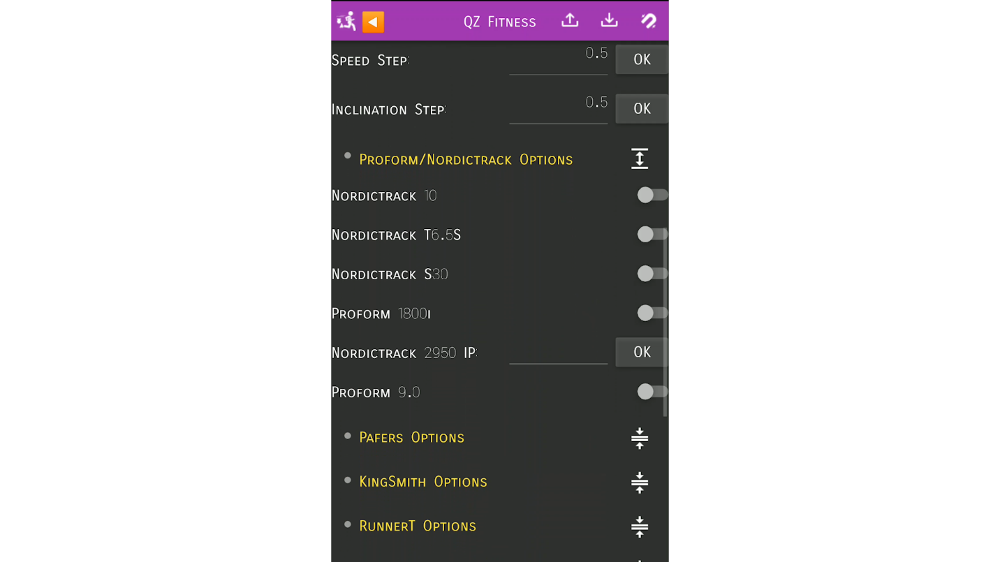
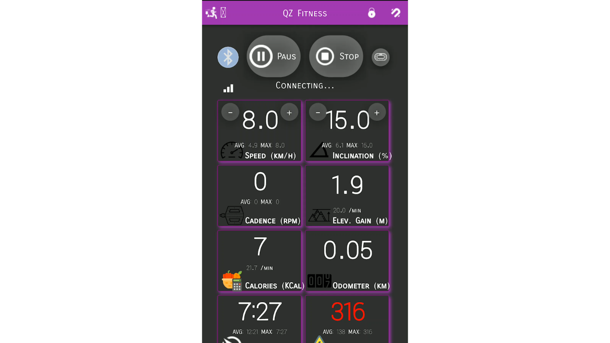
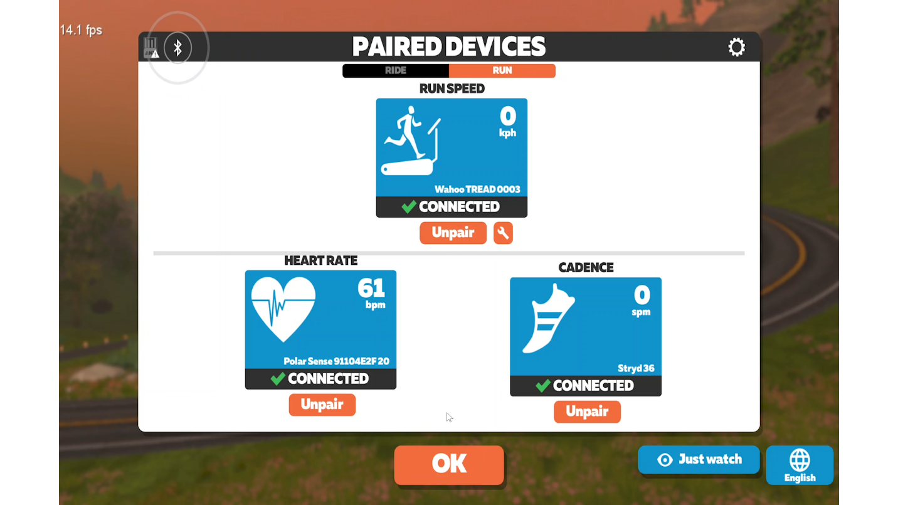

# QZCompanionNordictrackTreadmill
Companion App of QZ for Nordictrack Treadmills

Reference: https://github.com/cagnulein/qdomyos-zwift/issues/815

**QZ-Companion Installation**

Authors: Al Udell and Roberto Viola

Updated: December 15, 2022

QZ and QZ Companion software development: Roberto Viola

QZ on Facebook - <https://www.facebook.com/groups/149984563348738>

**Technical Overview:** The QZ Companion app, when installed on your
treadmill, communicates live speed and inclination to the QZ app
running on another device (e.g. Windows PC or laptop, Android phone or
tablet, or iOS iPhone or iPad). QZ then communicates this information to
Zwift running on a 3rd device (e.g. Windows PC or laptop, Android
phone or tablet, or iOS iPhone or iPad). A 2nd device could be used to
run both QZ and Zwift, eliminating the need for a 3rd device, as long
as QZ runs in the background while Zwift runs in the foreground. This only
works consistently on Windows and iOS, but not Android.

**New Feature:** QZ Companion now works with QZ to control the incline of your treadmill (auto-incline),
and speed as well (auto-speed). For example, you can choose to have Zwift control your
treadmill incline as you travel over the vurtual world terrain. Or, you can choose to load
a GPX file in QZ and have the treadmill incline follow the GPX file.

**New Feature:** We have just started implementing support for iFit-enabled/iFit-embedded
NordicTrack or Pro-Form bikes with built-in Android tablet. We will update this document as
bike models are tested and confirmed to work.

**About QZ Companion**:

-   This solution works on iFit-enabled/iFit-embedded treadmills. It
    transmits speed and inclination directly to Zwift.

-   The QZ Companion app always runs in the background on your
    treadmill, using minimal memory and CPU.

-   QZ Companion will auto-start when the treadmill is powered on. There
    is no need to enter the treadmills "privileged mode" after initial
    installation.

-   QZ Companion is not affected by Android or iFit updates. It
    continues to auto-start and run in the background after iFit and
    Android updates.

-   You can use flexible equipment startup sequences - e.g. start your
    treadmill first, HRM monitor second, QZ app third, Zwift last, or
    change the sequence. QZ will always communicate with QZ Companion
    regardless of your startup sequence.
    
**About QZ (QZ Fitness)**:

-   QZ is a cross-platform app (iOS, Android, Raspberry, Windows, and Mac) that acts as a native Bluetooth protocol bridge for many exercise machines (spin bikes, treadmills, bike trainers, rowers, and ellipticals) to FTMS (FiTness Machine Service protocol) Bluetooth for direct connection to Zwift and other compatible apps.

-   Wahoo Direct Connect (DIRCON) protocol was recently added to QZ in order to bypass Bluetooth connection drop-outs that are common during a bike or running race (Wifi and Ethernet is considerably more stable than Bluetooth).

**Disclaimer**: I have only tested this solution on a
NordicTrack Commercial 2950 (2021 model) treadmill with a built-in 22"
touchscreen. However, it should work on any iFit-enabled/iFit-embedded
NordicTrack or Pro-Form treadmill with built-in Android tablet. Refer to
<https://www.ifit.com/equipment/treadmills> for more details.

**Important**: Please let us know if you get this to work on your treadmill so we can
compile a list of compatible machines.

NordicTrack Commercial 2950 (2021 model)

**About iFit**: To workout in Zwift, you will need to logon to iFit on
your treadmill in order to use manual mode. However, you do not need an
iFit subscription to use the treadmills manual mode.

**Installation Instructions:** 

QZ Companion can be installed in one of two ways. Both methods make no changes to the underlying Android or iFit structure and can be easily removed via an uninstall script or by doing a treadmill factory reset.

If you have USB debugging mode enabled
and know your treadmills IP, you can skip to step 4.

1.  Factory reset the treadmill. It is highly recommended that you
    factory reset your treadmill before continuing. In my case, a reset
    is performed on my NT C2950 by pressing in and holding the pinhole
    style reset button on in the left-side on the console while
    simultaneously turning on the treadmill with the power switch. I use
    a paper-clip to push the reset button in. The reset button must be
    released after 10 seconds of turning the treadmill on.
    Unfortunately, the reset button and power switch are far apart and
    may require two people to coordinate the reset. After the 10 second
    reset, the console will display the reset and progress animation.
    The reset usually takes about 5 -7 minutes on my treadmill. When
    it is done, iFit will prompt you do login and select your Wifi
    network.

2.  Enable Privileged mode. When you see the main iFit dashboard screen,
    tap on an area of white that doesn't activate anything (e.g. the top
    of the screen) 10 times, count 7 seconds, then tap on the same spot
    10 more times. If done correctly, you will see the Privileged mode
    activation screen. Open the website https://getresponsecode.com and
    enter the first 6-digit code you see on your treadmill screen and
    click Submit. The website will provide a response code which you
    will enter in the treadmill console via the onscreen keyboard. If
    done correctly, a message at the bottom of the screen appears
    confirming privileged mode is enabled, and the Android desktop will
    appear.

3.  Enable USB debugging. From the treadmills Android desktop, swipe up
    from the bottom of the screen to open the installed apps screen.
    Select Settings, System, Advanced settings, and About tablet. Take
    note of the treadmills IP address (e.g. 10.0.0.124), and also look
    for the Build number. Tap on the Build number 7 times. You will get
    a message at the bottom of the screen confirming Developer options
    is unlocked. Next, select the back button/arrow to return to the
    previous Advanced settings screen. Select Developer options and look
    for USB Debugging -- turn it on. Select Ok when the 'Enable USB
    debugging' prompt appears.

    Enable USB Debugging on your treadmill

**QZ Companion Installation Method 1:  Over Wifi via an ADB script run from a Windows PC. Choose this method if you can successfully establish an ADB connection between treadmill and Windows PC.**

4.  Install the QZ Companion app on your treadmill. Download the QZ
    Companion installation package from this Github repository and extract
    it to your Windows PC. Go into the extracted folder and run
    qz-companion.bat by either double-clicking it or running it from the
    command-line. When prompted to enter the treadmills IP address,
    enter the same IP as noted in previous Step 3 and hit enter. The
    script will ping the IP address first to ensure it is reachable on
    the network, then proceed to open an ADB connection and install the
    QZ Companion app. When completed, the script will reboot the
    treadmill. Once rebooted, proceed to login to iFit. At this point,
    QZ Companion is running in the background and is ready to transmit
    treadmill speed and incline data to QZ.
    
    If it reads all 0's, try going to the treadmill's Settings > Apps > QZ Companion app > Permissions, and enabling all permissions.

    Run QZ-Companion.bat on a Wifi connected Windows PC

**QZ Installation Method 2: Via the treadmill build-in web browser.**

4.	To install the QZ Companion app on your treadmill via the treadmill built-in web browser, 
    from the treadmills Android desktop, swipe up from the bottom of the screen to open the installed apps screen. 
    Select Browser.

    Open the treadmill build-in web browser

-   Enter the following short URL address – https://tinyurl.com/qz-companion. This link will download the latest QZ Companion APK to the browser download folder on your treadmill.

    QZ Companion APK downloaded

-   Next, select the APK to start installation. You will get a warning message stating your tablet is not allowed to install 
apps from unknown sources. Rest assured, QZ Companion is safe to install. Select “Settings” which will bring you to a 
screen where you can toggle on “allow from this source” and confirm “do you want to install this application?”. 
QZ Companion will proceed to install. You will get a confirmation screen when done.

    QZ Companion APK installation screens

-   When completed, you should reboot the treadmill by cycling the power switch. Once rebooted, proceed to login to iFit. 
At this point, QZ Companion is running in the background and is ready to transmit treadmill speed and incline data to QZ.

**Now that QZ Companion is installed and running on your treadmill, it’s time to configure QZ to communicate with QZ Companion.**

5.  Configure QZ to communicate with QZ Companion. On your 2nd QZ
    device (Windows PC or laptop, Android phone or tablet, or iOS iPhone
    or iPad), open QZ and go to Settings. Expand Treadmill Options,
    Proform/NordicTrack Options, and enter the treadmills IP address under
    NordicTrack 2950 IP and hit OK. Exit and relaunch QZ to activate the
    change. If done correctly, QZ will display live data tiles to
    indicate it is communicating directly with QZ Companion on the
    treadmill. Next in QZ, expand Experimental Features and turn on
    Enable Virtual Device, Virtual Device Bluetooth, and Wahoo Direct
    Connect. Exit and relaunch QZ again to activate the changes. Wahoo
    direct connect will now transmit the treadmills speed and incline
    data to Zwift via Bluetooth.

    Enter your treadmill IP address in QZ

Turn on Enable Virtual Device, Virtual Device Bluetooth in QZ

    Turn on Wahoo Direct Connect in QZ

6.  Start an iFit manual workout to confirm QZ Companion communication.
    From the main iFit dashboard screen on your treadmill, select Manual
    workout. QZ Companion will immediately begin to transmit live speed
    and incline changes to QZ which will display in the live data tiles.
    At this point, you can take advantage of the many features of QZ
    while working out or simply use it to transmit data to Zwift.

    Start an iFit manual workout

    QZ receiving live speed and incline from QZ Companion

7.  Finally, launch and configure Zwift to use the QZ Bluetooth device.
    Now that QZ is receiving live treadmill data from QZ Companion,
    Zwift can be configured to receive this data from QZ over Bluetooth.
    At the Zwift Paired Devices screen, under Run Speed, search and
    select Wahoo Tread device (this is QZ). Optionally select your Heart
    Rate and Cadence devices and proceed to start a Zwift workout. Zwift
    will receive live speed and incline data from your treadmill via QZ
    and QZ Companion data link.

    Select Wahoo Tread device as Run Device in Zwift

    Start a Zwift workout and control speed from your treadmill

**The QZ Companion installation package (qz-companion.zip) contains**:

-   QZCompanionNordictrackTreadmill.apk (QZ Companion Android app).

-   QZ-Companion.bat (batch script used to install QZ Companion via
    ADB).

-   QZ-Companion-simple.bat (alternative batch script to use if you wish
    to run the commands separately for debugging and troubleshooting
    purposes).

-   Uninstall-QZ-Companion.bat (batch script used to uninstall/remove QZ
    Companion).

-   All other files (adb.exe, AdbWinApi.dll, AdbWinUsbApi.dll, tee.exe) are required for the scripts. Do not delete them.

**Troubleshooting**:

-   The primary reason QZ Companion installation will likely fail is
    because your Windows PC can't communicate with the treadmill IP
    address over your Wifi network. Ensure both devices are connected to
    the same Wifi network. The installation script will first attempt to
    ping your treadmill IP address. If this ping fails, you will need to
    troubleshoot the connection.

-   When executed, the QZ-Companion.bat installation script will
    generate a log file named QZ-Companion-log.txt. If communication fails
    or the app fails to install on your treadmill, refer to this log to
    troubleshoot specific errors. You may be required to share this log
    to obtain technical support.
